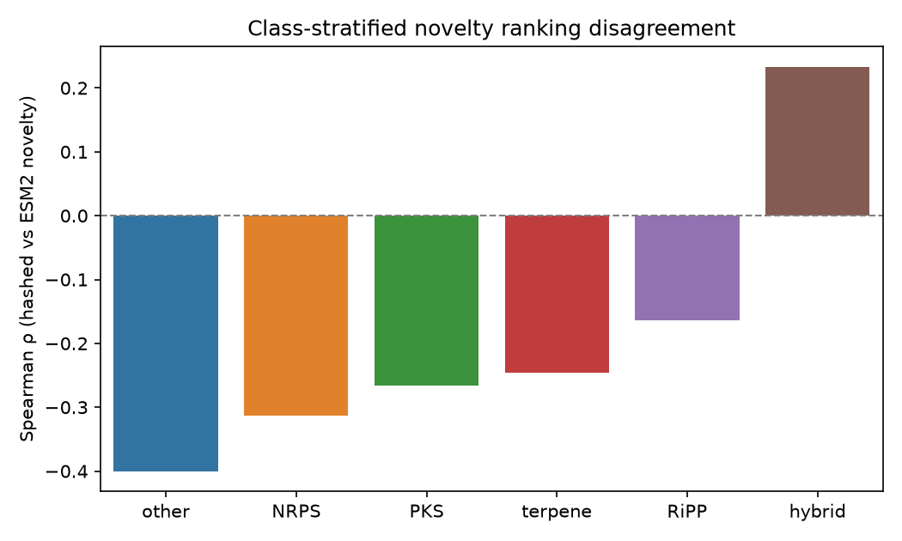

# bgc_atlas

**A reproducible framework for evaluating whether learned representations of microbial biosynthetic gene clusters can identify unexplored regions of chemical space.** Combines interpretable architecture features, protein language model embeddings, rigorous leakage audits, and prospective validation.

[](https://github.com/snowe36/bgc_atlas/actions/workflows/ci.yml)
[](LICENSE)


Repo: [github.com/snowe36/bgc_atlas](https://github.com/snowe36/bgc_atlas)

---

## The problem

Microbial genomes encode far more biosynthetic gene clusters than have been experimentally characterized ([MIBiG](https://mibig.secondarymetabolites.org/); [antiSMASH](https://docs.antismash.secondarymetabolites.org/)). Rule-based tools already answer "is this a BGC, and what class?" well. The harder ML question is:

**Can representation learning actually predict discovery — and can we validate that claim rigorously?**

This is a representation-learning / novelty-ranking problem with explicit negative controls, not a classification demo.

---

## What this repo builds

1. **Featurize** MIBiG BGCs into interpretable architecture vectors (domain counts + hashed ordered architecture)
2. **Benchmark** whether those features recover known biosynthetic classes (sanity check that the space is biologically meaningful)
3. **Map** the space (PCA atlas) and **rank** clusters by leave-one-out kNN novelty
4. **Validate** against label leakage, size confounds, and a prospective temporal holdout
5. **Ablate** against optional ESM2 protein-language-model embeddings (GPU) — same CV protocol, honest comparison


---

## Key results

| Check | Result |
|-------|--------|
| Representation recovers known classes | RF macro-F1 **0.76**, weighted-F1 **0.79** (5-fold CV) |
| Class-label leakage into novelty features | **None** |
| Novelty ↔ cluster size (Spearman) | **0.55** — moderate size confound; not the whole story |
| Prospective holdout | Architecture novelty alone is **insufficient** as a discovery predictor (held-out mean 0.40 vs control 0.50) |
| Hashed vs ESM2-650M alone (class recovery) | ~tied (0.78 vs **0.80** macro-F1) |
| Combined hashed + ESM2-650M | **0.84** macro-F1 — complementary signal for annotation |
| Do novelty *rankings* agree across representations? | **No** (Spearman ρ=**-0.38**; top-decile overlap **1.7%**) |
| Disagreement by class | Strongest anti-agree in **other / NRPS**; **hybrid** positively correlates (ρ=+0.23) |

---

## Research takeaway

Three conclusions emerged:

1. **Architecture features** capture recognizable biosynthetic classes.
2. **ESM2 embeddings** provide complementary biological signal and modestly improve classification.
3. **Novelty ranking** is highly representation-dependent and does not yet translate into prospective discovery prediction.

---

## Quick start

Requires [uv](https://docs.astral.sh/uv/):

```bash
git clone https://github.com/snowe36/bgc_atlas.git && cd bgc_atlas
uv sync --extra dev
bash scripts/reproduce.sh && uv run pytest -q
```

CPU pipeline (locked deps via [`uv.lock`](uv.lock); CI on every push):

```text
bgc-download → bgc-featurize → bgc-sanity → bgc-atlas → bgc-novelty → bgc-validate → bgc-apply → bgc-temporal
```

Optional GPU step (ESM2-650M + length-weighted pooling; `uv sync --extra embed`):

```bash
uv sync --extra embed
python scripts/run_esm_embed.py
uv run bgc-ablation && uv run bgc-novelty-compare
```

---

## Representation & class-recovery benchmark

Interpretable **pathway architecture features** (CPU):

- Domain / CDS-product token counts
- Hashed ordered architecture (domain unigrams + bigrams)
- Cluster size statistics

**2,762 × 342** feature matrix. Biosynth class labels are used for coloring and sanity checks only — **never** as novelty features.

| Model | Macro-F1 | Weighted-F1 |
|-------|---------:|------------:|
| Logistic regression | 0.65 | 0.68 |
| **Random forest** | **0.76** | **0.79** |


NRPS/PKS separate cleanly; hybrid and "other" are harder (as expected). Full metrics: [`reports/sanity_metrics.json`](reports/sanity_metrics.json).

---

## Atlas & novelty scoring

Architecture features → standardized PCA (**50-D**, ~72% variance) for distances; 2-D map for visualization (UMAP optional; PCA default). Leave-one-out **kNN distance** + local rarity → composite novelty ∈ [0, 1].

> **Definition.** *Novelty* here means divergence in **biosynthetic architecture space**, not experimentally confirmed chemical novelty.

Hero artifact: [`reports/novelty_ranking.csv`](reports/novelty_ranking.csv)

| Rank | BGC ID | Organism | Class | Score | Nearest MIBiG |
|-----:|--------|----------|-------|------:|---------------|
| 1 | BGC0002977 | *Bacillus subtilis* fmb60 | hybrid | 1.00 | BGC0000081 |
| 2 | BGC0000103 | *Mycobacterium ulcerans* Agy99 | PKS | 1.00 | BGC0000038 |
| 3 | BGC0002124 | *Actinomadura verrucosospora* | PKS | 1.00 | BGC0002587 |
| 4 | BGC0000315 | *Streptomyces coelicolor* A3(2) | NRPS | 1.00 | BGC0000324 |
| 5 | BGC0002808 | *Streptomyces scabiei* 87.22 | PKS | 1.00 | BGC0001063 |


Hybrids and PKS sit higher on average; RiPPs are denser / more self-similar in this feature space. Atlas plots use robust (percentile-based) axis limits so size outliers don't collapse the view.

---

## Validation

Integrity checks are first-class (`bgc-validate` → [`reports/validation_audit.json`](reports/validation_audit.json)):

| Check | Result |
|-------|--------|
| **Class-label leakage into features** | **none** |
| Top-decile same-class neighbor rate | **0.67** |
| Novelty ↔ gene-count Spearman | **0.55** (moderate size confound) |
| Top-50 size outliers flagged | **4** |
| Checks passed | **yes** |


Size is a real correlate of architecture-novelty in this space (larger clusters tend to sit farther from neighbors), but ρ=0.55 is not "novelty = size." Leakage and same-class neighbor checks remain clean.

---

## Prospective (temporal-holdout) validation

MIBiG's changelog carries a real submission date per entry. Fit the reference manifold on BGCs added **before** a cutoff, then ask whether entries added **after** score as architecture-novel relative to a size-matched random-holdout control (`bgc-temporal` → [`reports/temporal_holdout.json`](reports/temporal_holdout.json)).

| Cutoff | Subset | Reference | Held-out | Held-out mean | Control mean | p (held-out > control) |
|--------|--------|----------:|---------:|--------------:|-------------:|-----------------------:|
| 2022-09-16 | All classes | 2,472 | 290 | **0.397** | **0.495** | **0.997** |
| 2022-09-16 | Exclude PKS/NRPS/hybrid | — | 117 | **0.310** | **0.491** | **1.000** |


Prospective validation revealed that **architecture novelty alone is insufficient as a discovery predictor**. Post-cutoff entries scored *less* architecture-novel than a random control; restricting to non-major families (RiPP / terpene / other) does not reverse the result. That is the scientific conclusion: distance from known architecture neighborhoods, under this representation, does not forecast which BGCs enter MIBiG next.

---

## Protein language model embeddings

After validating the CPU discovery strategy, ask whether a protein language model changes the picture.

**Hypothesis:** sequence-derived embeddings may capture evolutionary and functional relationships missed by architecture-only features.

[`scripts/run_esm_embed.py`](scripts/run_esm_embed.py) embeds MIBiG CDS translations with **ESM2** via HuggingFace `transformers` and pools per BGC. Current defaults (override with flags):

| Knob | Legacy (150M) | Current default |
|------|---------------|-----------------|
| Model | `esm2_t30_150M` | `esm2_t33_650M` |
| Pooling | uniform mean | **length-weighted** (longer enzymes count more) |
| Max AA / proteins | 700 / 60 | 1024 / 80 |
| Cache | BGC matrix only | + protein-level cache + `esm_embed_manifest.json` |

```bash
uv sync --extra embed
# full GPU embed (writes esm_embeddings.npy + protein cache + manifest)
python scripts/run_esm_embed.py
# re-pool without GPU after the first run
python scripts/run_esm_embed.py --from-cache --pooling mean
# legacy 150M mean-pool bake-off
python scripts/run_esm_embed.py --model facebook/esm2_t30_150M_UR50D --pooling mean --max-aa 700
uv run bgc-ablation && uv run bgc-novelty-compare
```

**Classification ablation** (ESM2-650M + length-weighted → [`reports/ablation_metrics.json`](reports/ablation_metrics.json); legacy 150M mean-pool in parentheses):

| Representation | Macro-F1 | Weighted-F1 |
|----------------|---------:|------------:|
| Hashed architecture (CPU baseline) | 0.78 | 0.81 |
| ESM2 alone | **0.80** (legacy: 0.76) | **0.80** (legacy: 0.76) |
| **Combined (hashed + ESM2)** | **0.84** (legacy: 0.83) | **0.84** (legacy: 0.85) |


ESM2-650M alone edges the hashed baseline on macro-F1 (0.80 vs 0.78); combined still wins. Labels follow `esm_embed_manifest.json` (`esm2-t33_650M_length_weighted`).

**Result:** ESM improves class recovery but produces substantially different novelty rankings.

**Novelty ranking comparison** (`bgc-novelty-compare` → [`reports/novelty_representation_comparison.json`](reports/novelty_representation_comparison.json)):

| Comparison | Spearman ρ | Top-decile Jaccard |
|------------|-----------:|-------------------:|
| Hashed vs. ESM2 novelty | **-0.38** (legacy: -0.42) | **1.7%** (legacy: 1.5%) |
| Hashed vs. combined | -0.12 (legacy: +0.06) | 10.7% (legacy: 19.5%) |
| ESM2 vs. combined | — | **67.6%** (legacy: 46.7%) |


Rankings still barely agree at the top — representation dependence remains. Combined novelty tracks ESM2 more tightly under the 650M setup (Jaccard 68% vs 47% under the legacy 150M bake-off), so the joint space is ESM-dominated.

The combined representation improves class recovery but does not recover the same novelty landscape as architecture features, suggesting that **representation fusion improves annotation but does not necessarily stabilize discovery ranking**.

**Class-stratified disagreement** ([`reports/novelty_disagreement_by_class.csv`](reports/novelty_disagreement_by_class.csv)):

| Class | n | Spearman ρ (hashed vs ESM2) | Top-decile Jaccard |
|-------|--:|----------------------------:|-------------------:|
| other | 474 | **-0.40** | 2.2% |
| NRPS | 538 | **-0.31** | 1.9% |
| PKS | 695 | -0.27 | 3.7% |
| terpene | 166 | -0.25 | 0.0% |
| RiPP | 359 | -0.16 | 1.4% |
| hybrid | 404 | **+0.23** (legacy: −0.02) | **11.1%** |



Disagreement is strongest in **other / NRPS**. With ESM2-650M, hybrids flip to a *positive* rank correlation (ρ=+0.23) with modestly higher top-decile overlap (11%) — the rest of the classes still anti-agree.

---

## Apply to new genomes

Score predicted BGCs against the MIBiG manifold (`bgc-apply` → [`reports/predicted_novelty_ranking.csv`](reports/predicted_novelty_ranking.csv)). Supports antiSMASH region GenBanks and JSON.

```bash
# curated demo (default)
uv run bgc-apply

# antiSMASH region GenBanks (preferred — domains from aSDomain / PFAM_domain)
uv run bgc-apply --input /path/to/antismash_outdir --genome MyStreptomyces

# antiSMASH JSON (areas/products; CDS domains when present)
uv run bgc-apply --input /path/to/result.json

# pre-normalized domains CSV (genome,bgc_id,predicted_class,gene_order,domain_id,n_genes)
uv run bgc-apply --input data/external/predicted_domains.csv
```

Demo ranking (illustration only):

| Rank | Genome (demo label) | BGC | Predicted class | Score | Nearest MIBiG |
|-----:|---------------------|-----|-----------------|------:|---------------|
| 1 | Rare_actinobacterium_predicted | PRED0006 | other | 0.64 | BGC0002148 |
| 2 | Rare_actinobacterium_predicted | PRED0007 | NRPS | 0.64 | BGC0002608 |
| 3 | Myxococcus_sp_predicted | PRED0008 | hybrid | 0.64 | BGC0002608 |

---

## Data

| Item | Detail |
|------|--------|
| Source | [MIBiG 4.0](https://mibig.secondarymetabolites.org/) JSON + GenBank |
| Parsed | **3,013** JSON · **2,636** GenBank |
| Featurized | **2,762** BGCs with gene annotations |
| Classes | PKS 717 · NRPS 556 · other 482 · hybrid 413 · RiPP 413 · terpene 181 |
| Proteins | **46,957** CDS translations (**2,636** BGCs with ≥1 usable sequence) |
| Temporal metadata | **100%** coverage via MIBiG changelog dates |
| Demo set | [`data/external/`](data/external/) (illustration only) |

---

## Limitations

- Scores reflect **architecture** divergence, not proven new chemistry
- Novelty correlates moderately with cluster size (Spearman **0.55**)
- Architecture novelty alone does not forecast which entries enter MIBiG next
- Novelty rankings are **representation-dependent** (hashed vs ESM2 barely agree)
- Product-class / bioactivity prediction are out of scope
- Domains are inferred from CDS products (raw MIBiG GenBank lacks antiSMASH domain calls)
- ESM2-650M + length-weighted embeddings improve class recovery but do not stabilize novelty rankings with hashed architecture
- antiSMASH ingest supports region GBK/JSON; still not a full antiSMASH-DB-scale discovery campaign

---

## Future directions

The natural next step is **contrastive / metric learning with a biological objective**: pull together evolutionarily related BGCs, separate unrelated architectures, and evaluate whether learned distances improve prospective discovery prediction. That moves from representation analysis to method development.

Also worth exploring:

- Longer lead-time temporal cutoffs (and organism-stratified holdouts)
- Larger predicted-genome prioritization sets (antiSMASH-DB scale)

---

## How to reproduce (detail)

```bash
# install uv if needed: curl -LsSf https://astral.sh/uv/install.sh | sh
# or: brew install uv
git clone https://github.com/snowe36/bgc_atlas.git
cd bgc_atlas
uv sync --extra dev
bash scripts/reproduce.sh
uv run pytest -q
```

Optional GPU path (ESM2-650M + length-weighted):

```bash
uv sync --extra embed   # torch + transformers
python scripts/run_esm_embed.py
uv run bgc-ablation && uv run bgc-novelty-compare
```

UMAP for 2-D maps: `uv sync --extra umap` (PCA is the default).

---

## Project layout

```text
src/bgcatlas/        package (config, embed_pool, data/antismash, featurize, models, atlas, novelty)
scripts/             reproduce.sh + run_esm_embed.py (GPU ESM2)
uv.lock              locked dependency versions
data/raw|processed/  MIBiG download + feature matrices (gitignored bulk)
data/external/       demo predicted BGCs + last apply cache
reports/             rankings, metrics, figures
tests/               unit tests + antiSMASH fixtures
.github/workflows/   CI (uv sync + ruff + pytest)
```

---

## License

MIT
