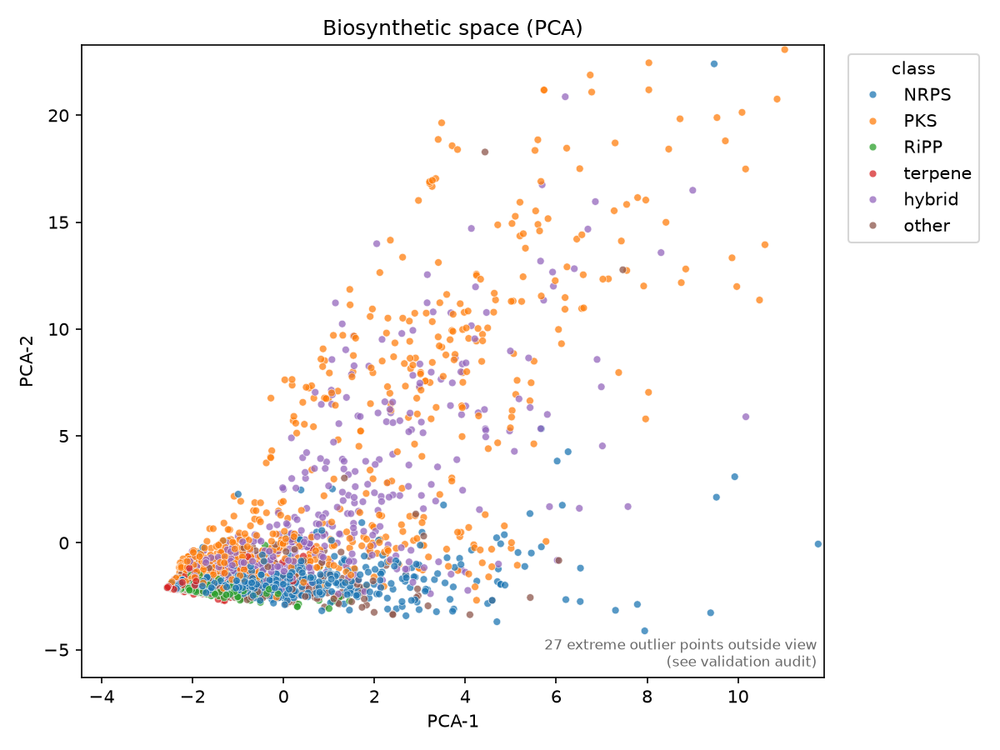
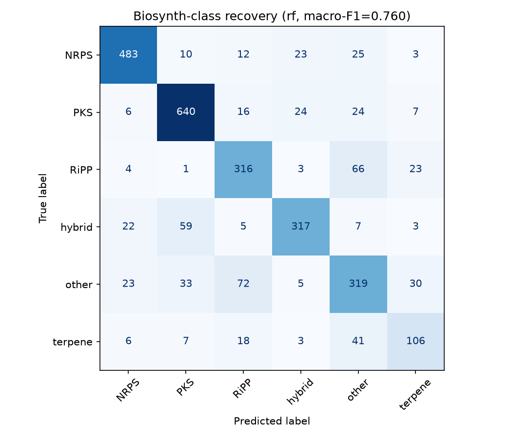
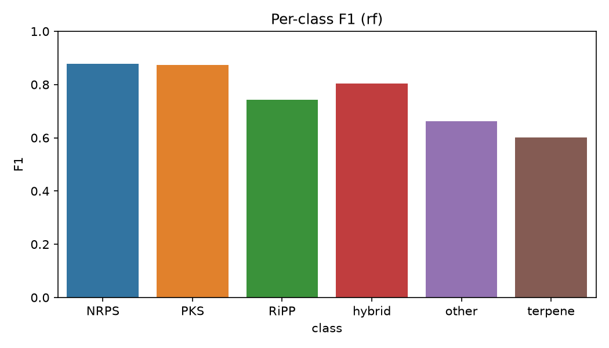
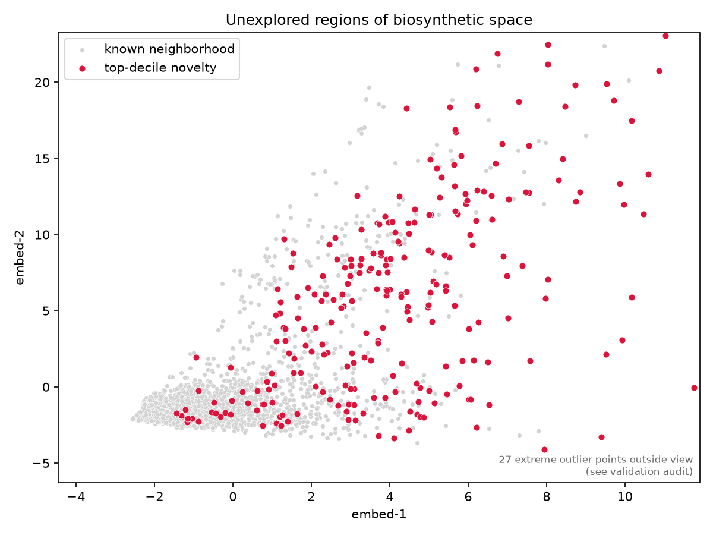
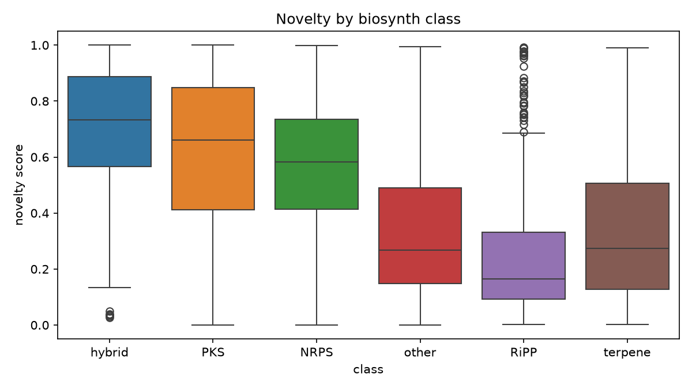
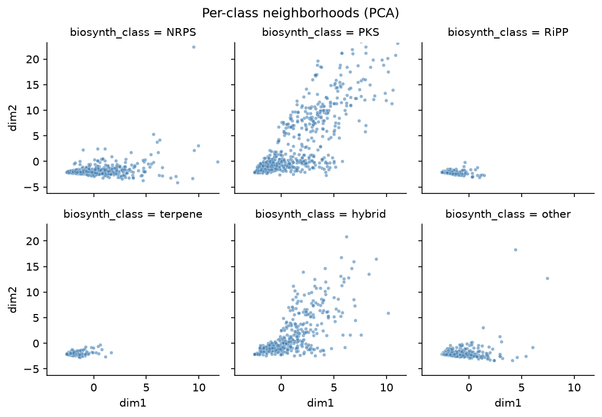
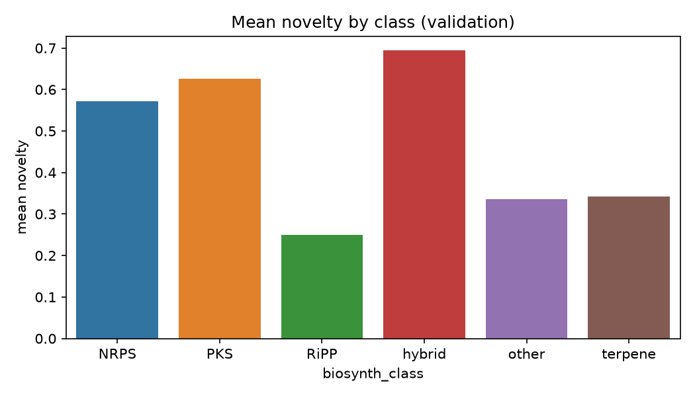
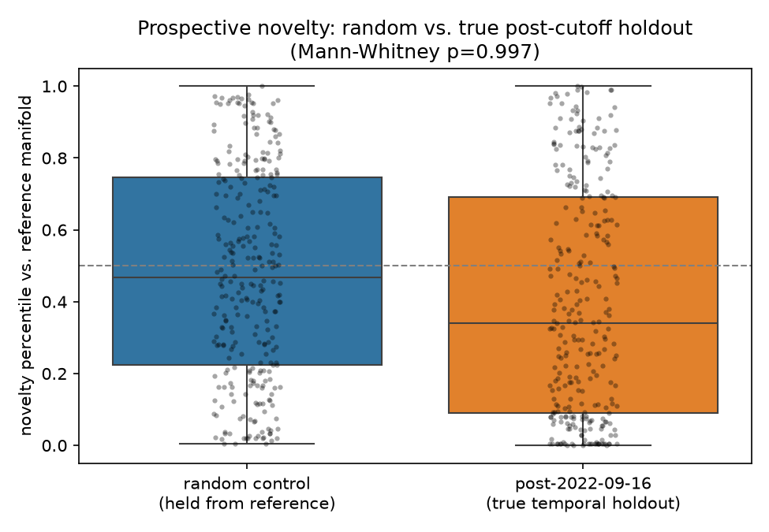
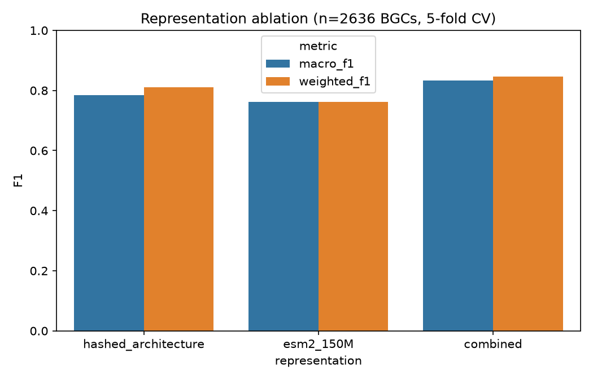
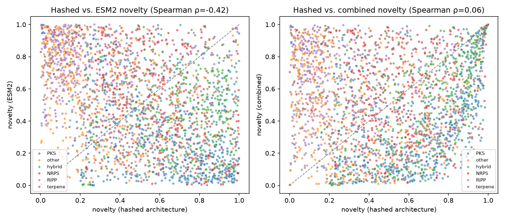

# bgc_atlas

**A reproducible framework for learning and validating representations of microbial biosynthetic space** — map biosynthetic gene cluster (BGC) neighborhoods, rank architecture-novel regions, and stress-test those rankings with leakage checks, size-confound audits, and a prospective (time-split) holdout. Interpretable CPU baselines first; optional GPU-accelerated protein language model embeddings for ablation.

[](https://github.com/snowe36/bgc_atlas/actions/workflows/ci.yml)
[](LICENSE)


Repo: [github.com/snowe36/bgc_atlas](https://github.com/snowe36/bgc_atlas)

---

## The problem

Microbial genomes encode far more biosynthetic gene clusters than have been experimentally characterized ([MIBiG](https://mibig.secondarymetabolites.org/); [antiSMASH](https://docs.antismash.secondarymetabolites.org/)). Rule-based tools already answer "is this a BGC, and what class?" well. The harder ML question is:

**Can we learn a representation of biosynthetic architecture space such that distance from known neighborhoods is a useful discovery signal — and can we validate that claim rigorously?**

This is a representation-learning / novelty-ranking problem with explicit negative controls, not a classification demo.

---

## What this repo builds

1. **Featurize** MIBiG BGCs into interpretable architecture vectors (domain counts + hashed ordered architecture)
2. **Benchmark** whether those features recover known biosynthetic classes (sanity check that the space is biologically meaningful)
3. **Map** the space (PCA atlas) and **rank** clusters by leave-one-out kNN novelty
4. **Validate** against label leakage, size confounds, and a prospective temporal holdout
5. **Ablate** against optional ESM2 protein-language-model embeddings (GPU) — same CV protocol, honest comparison



---

## Key results

| Check | Result |
|-------|--------|
| Representation recovers known classes | RF macro-F1 **0.76**, weighted-F1 **0.79** (5-fold CV) |
| Class-label leakage into novelty features | **None** |
| Novelty dominated by cluster size | **No** (Spearman = **0.12**) |
| Prospective holdout: do newer MIBiG entries score as novel? | **Not supported** (held-out mean 0.40 vs random-control 0.50; p=0.997) — reported as a negative result |
| Hashed vs ESM2 alone (class recovery) | ~tied (0.78 vs 0.76 macro-F1) |
| Combined hashed + ESM2 | **0.83** macro-F1 — complementary signal |
| Do novelty *rankings* agree across representations? | **No** (Spearman ρ=**-0.42**; top-decile overlap **1.5%**) |

---

## Quick start

Requires [uv](https://docs.astral.sh/uv/):

```bash
git clone https://github.com/snowe36/bgc_atlas.git && cd bgc_atlas
uv sync --extra dev
bash scripts/reproduce.sh && uv run pytest -q
```

CPU pipeline (locked deps via [`uv.lock`](uv.lock); CI on every push):

```text
bgc-download → bgc-featurize → bgc-sanity → bgc-atlas → bgc-novelty → bgc-validate → bgc-apply → bgc-temporal
```

Optional GPU step: `scripts/run_esm_embed.py`, then `uv run bgc-ablation` and `uv run bgc-novelty-compare`.

---

## Representation & class-recovery benchmark

Interpretable **pathway architecture features** (CPU):

- Domain / CDS-product token counts
- Hashed ordered architecture (domain unigrams + bigrams)
- Cluster size statistics

**2,762 × 342** feature matrix. Biosynth class labels are used for coloring and sanity checks only — **never** as novelty features.

| Model | Macro-F1 | Weighted-F1 |
|-------|---------:|------------:|
| Logistic regression | 0.65 | 0.68 |
| **Random forest** | **0.76** | **0.79** |





NRPS/PKS separate cleanly; hybrid and "other" are harder (as expected). Full metrics: [`reports/sanity_metrics.json`](reports/sanity_metrics.json).

---

## Atlas & novelty scoring

Architecture features → standardized PCA (**50-D**, ~72% variance) for distances; 2-D map for visualization (UMAP optional; PCA default). Leave-one-out **kNN distance** + local rarity → composite novelty ∈ [0, 1].

> **Definition.** *Novelty* here means divergence in **biosynthetic architecture space**, not experimentally confirmed chemical novelty.

Hero artifact: [`reports/novelty_ranking.csv`](reports/novelty_ranking.csv)

| Rank | BGC ID | Organism | Class | Score | Nearest MIBiG |
|-----:|--------|----------|-------|------:|---------------|
| 1 | BGC0002977 | *Bacillus subtilis* fmb60 | hybrid | 1.00 | BGC0000081 |
| 2 | BGC0000103 | *Mycobacterium ulcerans* Agy99 | PKS | 1.00 | BGC0000038 |
| 3 | BGC0002124 | *Actinomadura verrucosospora* | PKS | 1.00 | BGC0002587 |
| 4 | BGC0000315 | *Streptomyces coelicolor* A3(2) | NRPS | 1.00 | BGC0000324 |
| 5 | BGC0002808 | *Streptomyces scabiei* 87.22 | PKS | 1.00 | BGC0001063 |







Hybrids and PKS sit higher on average; RiPPs are denser / more self-similar in this feature space. Atlas plots use robust (percentile-based) axis limits so size outliers don't collapse the view.

---

## Validation

Integrity checks are first-class (`bgc-validate` → [`reports/validation_audit.json`](reports/validation_audit.json)):

| Check | Result |
|-------|--------|
| **Class-label leakage into features** | **none** |
| Top-decile same-class neighbor rate | **0.67** |
| Novelty ↔ gene-count correlation | **0.12** (not size-dominated) |
| Top-50 size outliers flagged | **4** |
| Checks passed | **yes** |



---

## Prospective (temporal-holdout) validation

MIBiG's changelog carries a real submission date per entry. Fit the reference manifold on BGCs added **before** a cutoff, then ask whether entries added **after** score as architecture-novel relative to a size-matched random-holdout control (`bgc-temporal` → [`reports/temporal_holdout.json`](reports/temporal_holdout.json)).

| Cutoff | Reference | Held-out | Held-out mean novelty | Random-control mean (± std) | Mann-Whitney p (held-out > control) |
|--------|----------:|---------:|----------------------:|----------------------------:|------------------------------------:|
| 2022-09-16 | 2,472 | 290 | **0.397** | **0.495** (± 0.018) | **0.997** |



**This does not support the hypothesis.** Post-cutoff entries scored *less* architecture-novel than a random control. Likely reading: recent MIBiG additions skew toward incremental variants of well-studied families, so "added recently" and "architecturally novel" measure different things. Reported as a negative result rather than reframed after the fact.

---

## GPU / protein language model embeddings

After validating the CPU discovery strategy, ask whether a protein language model changes the picture. [`scripts/run_esm_embed.py`](scripts/run_esm_embed.py) embeds MIBiG CDS translations with **ESM2** (`facebook/esm2_t30_150M_UR50D`) and mean-pools per BGC (GPU-only step; ~10 min on an A40).

**Classification ablation** (`bgc-ablation` → [`reports/ablation_metrics.json`](reports/ablation_metrics.json)):

| Representation | Macro-F1 | Weighted-F1 |
|----------------|---------:|------------:|
| Hashed architecture (CPU baseline) | 0.78 | 0.81 |
| ESM2 (150M) alone | 0.76 | 0.76 |
| **Combined (hashed + ESM2)** | **0.83** | **0.85** |



ESM2 alone is not better than hand-built architecture features for class recovery, but it carries complementary signal.

**Novelty ranking comparison** (`bgc-novelty-compare` → [`reports/novelty_representation_comparison.json`](reports/novelty_representation_comparison.json)):

| Comparison | Spearman ρ | Top-decile Jaccard |
|------------|-----------:|-------------------:|
| Hashed vs. ESM2 novelty | **-0.42** | **1.5%** |
| Hashed vs. combined | 0.06 | 19.5% |
| ESM2 vs. combined | — | 46.7% |



Hashed and ESM2 novelty pick almost entirely different top hits. "Architecture-novel" is representation-dependent — which is why the validation and holdout checks matter more than any single ranking.

---

## Apply to new genomes (demo)

**Demonstration only — not a discovery claim.** Curated predicted BGC domain tables in [`data/external/`](data/external/) illustrate scoring against the MIBiG manifold ([`reports/predicted_novelty_ranking.csv`](reports/predicted_novelty_ranking.csv)):

| Rank | Genome (demo label) | BGC | Predicted class | Score | Nearest MIBiG |
|-----:|---------------------|-----|-----------------|------:|---------------|
| 1 | Rare_actinobacterium_predicted | PRED0006 | other | 0.64 | BGC0002148 |
| 2 | Rare_actinobacterium_predicted | PRED0007 | NRPS | 0.64 | BGC0002608 |
| 3 | Myxococcus_sp_predicted | PRED0008 | hybrid | 0.64 | BGC0002608 |

---

## Data

| Item | Detail |
|------|--------|
| Source | [MIBiG 4.0](https://mibig.secondarymetabolites.org/) JSON + GenBank |
| Parsed | **3,013** JSON · **2,636** GenBank |
| Featurized | **2,762** BGCs with gene annotations |
| Classes | PKS 717 · NRPS 556 · other 482 · hybrid 413 · RiPP 413 · terpene 181 |
| Proteins | **46,957** CDS translations (**2,636** BGCs with ≥1 usable sequence) |
| Temporal metadata | **100%** coverage via MIBiG changelog dates |
| Demo set | [`data/external/`](data/external/) (illustration only) |

---

## Limitations

- Scores reflect **architecture** divergence, not proven new chemistry
- Temporal holdout did **not** confirm that novelty predicts which entries get added to MIBiG next
- Novelty rankings are **representation-dependent** (hashed vs ESM2 barely agree)
- Product-class / bioactivity prediction are out of scope
- Domains are inferred from CDS products (raw MIBiG GenBank lacks antiSMASH domain calls)
- ESM2 uses 150M mean-pooled embeddings (700 aa / 60 proteins per BGC caps)
- Predicted set is a curated demo, not antiSMASH-DB scale

---

## Future directions

- Why the temporal holdout was negative (non-major-family subsets; longer lead times)
- Why hashed and ESM2 novelty disagree so strongly (class-stratified analysis)
- Larger ESM2 checkpoint + domain-aware pooling
- Richer antiSMASH domain calls; larger predicted-genome prioritization sets

---

## How to reproduce (detail)

```bash
# install uv if needed: curl -LsSf https://astral.sh/uv/install.sh | sh
# or: brew install uv
git clone https://github.com/snowe36/bgc_atlas.git
cd bgc_atlas
uv sync --extra dev
bash scripts/reproduce.sh
uv run pytest -q
```

Optional GPU path:

```text
scripts/run_esm_embed.py → uv run bgc-ablation → uv run bgc-novelty-compare
```

UMAP for 2-D maps: `uv sync --extra umap` (PCA is the default).

---

## Project layout

```text
src/bgcatlas/        package (data, featurize, models, atlas, novelty)
scripts/             reproduce.sh + run_esm_embed.py (GPU-only)
uv.lock              locked dependency versions
data/raw|processed/  MIBiG download + feature matrices (gitignored bulk)
data/external/       demo predicted BGCs
reports/             rankings, metrics, figures
tests/               unit tests (6 passing)
.github/workflows/   CI (uv sync + pytest)
```

---

## License

MIT
