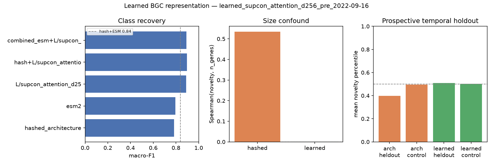

# bgc_atlas

**Myxobacterial genomes occupy more architecture-novel regions of biosynthetic space than *Streptomyces* — an enrichment that survives a ≤60-gene size control (OR = 2.9, 95% CI 1.8–4.9).** Yet architecture novelty alone does not predict which BGCs enter [MIBiG](https://mibig.secondarymetabolites.org/) next.

A reproducible framework that maps biosynthetic architectural space, audits novelty scores against leakage and confounds, and tests whether representation learning predicts discovery. The models are the instrument; the biological pattern is the result.

[](https://github.com/snowe36/bgc_atlas/actions/workflows/ci.yml)
[](LICENSE)


Repo: [github.com/snowe36/bgc_atlas](https://github.com/snowe36/bgc_atlas)

---

## Key findings

| Question | Answer |
|----------|--------|
| **What happened?** | **Observed:** myxobacterial BGCs are **2.9× enriched** in the top architecture-novelty decile vs *Streptomyces* after a ≤60-gene filter (OR = 2.9, 95% CI 1.8–4.9; Cliff’s δ = 0.21; Cohen’s *d* = 0.34; *p* = 7.5×10⁻⁴). Separately, architecture novelty does **not** predict future MIBiG entries on a prospective time split (held-out 0.40 vs control 0.50). |
| **Why trust it?** | Leakage audits pass; the clade signal **persists after size restriction** (the obvious “huge myxo BGCs” confound); prospective validation uses a temporal holdout with a matched random control. |
| **Why interesting?** | Novelty is phylogenetically structured — consistent with lineage-specific biosynthetic design patterns — yet representation choice reshapes which neighborhoods look novel, and none of the scores yet forecast discovery. |

```text
✓  Myxobacteria > Streptomyces in architecture novelty
      └── persists after ≤60-gene restriction
         OR=2.9 (95% CI 1.8–4.9) · δ=0.21 · d=0.34
✓  Architecture recovers known biosynthetic classes (RF macro-F1 0.76)
✓  Prospective result: novelty does not predict MIBiG deposition
     (architecture underperforms control; learned ties control)
✓  ESM2 improves class recovery (combined macro-F1 0.84) but novelty
     rankings barely agree with architecture (ρ=−0.38)
✓  Entire CPU benchmark is reproducible from raw data with one command
```

**Observed vs interpretation.** We measure novelty *relative to an architecture representation*, not evolutionary innovation directly. **Observed:** myxobacteria occupy higher-novelty regions of that space, and the gap survives size control. **Interpretation:** this is consistent with lineage-specific expansion of biosynthetic design patterns — a *biosynthetic grammar* in the conceptual sense.

---

## The problem

Microbial genomes encode far more biosynthetic gene clusters than have been experimentally characterized ([MIBiG](https://mibig.secondarymetabolites.org/); [antiSMASH](https://docs.antismash.secondarymetabolites.org/)). Rule-based tools already answer "is this a BGC, and what class?" well. The harder questions are biological *and* methodological:

**Where does architectural novelty concentrate — and can any representation of it predict discovery under an honest prospective test?**

---

## What this repo builds

1. **Featurize** MIBiG BGCs into interpretable architecture vectors (domain counts + hashed ordered architecture)
2. **Benchmark** whether those features recover known biosynthetic classes (sanity check that the space is biologically meaningful)
3. **Map** the space (PCA atlas) and **rank** clusters by leave-one-out kNN novelty
4. **Validate** against label leakage, size confounds, and a prospective temporal holdout
5. **Ablate** against optional ESM2 protein-language-model embeddings (GPU) — same CV protocol, honest comparison
6. **Learn** a contrastive BGC set-encoder over cached ESM2 protein vectors (GPU) and re-test the same honest suite


---

## Quick start

Requires [uv](https://docs.astral.sh/uv/):

```bash
git clone https://github.com/snowe36/bgc_atlas.git && cd bgc_atlas
uv sync --extra dev
bash scripts/reproduce.sh && uv run pytest -q
```

CPU pipeline (locked deps via [`uv.lock`](uv.lock); CI on every push):

```text
bgc-download → bgc-featurize → bgc-sanity → bgc-atlas → bgc-novelty
    → run_case_studies.py → bgc-validate → bgc-apply → bgc-temporal
```

Optional GPU path (ESM2 + contrastive encoder): see [`docs/esm.md`](docs/esm.md).

---

## Representation & class-recovery benchmark

**What this means:** the feature space is biologically meaningful — architecture vectors recover known biosynthetic classes well enough that novelty ranking is not measuring noise.

Interpretable **pathway architecture features** (CPU):

- Domain / CDS-product token counts
- Hashed ordered architecture (domain unigrams + bigrams)
- Cluster size statistics

**2,762 × 342** feature matrix. Biosynth class labels are used for coloring and sanity checks only — **never** as novelty features.

| Model | Macro-F1 | Weighted-F1 |
|-------|---------:|------------:|
| Logistic regression | 0.65 | 0.68 |
| **Random forest** | **0.76** | **0.79** |


NRPS/PKS separate cleanly; hybrid and "other" are harder (as expected). Full metrics: [`reports/sanity_metrics.json`](reports/sanity_metrics.json).

---

## Atlas & novelty scoring

Architecture features → standardized PCA (**50-D**, ~72% variance) for distances; 2-D map for visualization (UMAP optional; PCA default). Leave-one-out **kNN distance** + local rarity → composite novelty ∈ [0, 1].

> **Definition.** *Novelty* here means divergence in **biosynthetic architecture space**, not experimentally confirmed chemical novelty.

Hero artifact: [`reports/novelty_ranking.csv`](reports/novelty_ranking.csv)

| Rank | BGC ID | Organism | Class | Score | Nearest MIBiG |
|-----:|--------|----------|-------|------:|---------------|
| 1 | BGC0002977 | *Bacillus subtilis* fmb60 | hybrid | 1.00 | BGC0000081 |
| 2 | BGC0000103 | *Mycobacterium ulcerans* Agy99 | PKS | 1.00 | BGC0000038 |
| 3 | BGC0002124 | *Actinomadura verrucosospora* | PKS | 1.00 | BGC0002587 |
| 4 | BGC0000315 | *Streptomyces coelicolor* A3(2) | NRPS | 1.00 | BGC0000324 |
| 5 | BGC0002808 | *Streptomyces scabiei* 87.22 | PKS | 1.00 | BGC0001063 |


Hybrids and PKS sit higher on average; RiPPs are denser / more self-similar in this feature space. Atlas plots use robust (percentile-based) axis limits so size outliers don't collapse the view.

---

## Biological case studies

**Observed.** Myxobacterial BGCs occupy more architecture-novel regions of biosynthetic space than *Streptomyces* BGCs. The gap is not an artifact of giant clusters:

```text
Myxobacteria > Streptomyces in architecture novelty
       |
       └── persists after ≤60-gene restriction
              OR = 2.9 (95% CI 1.8–4.9)
              Cliff’s δ = 0.21 · Cohen’s d = 0.34 · p = 7.5×10⁻⁴
```

Unrestricted top-decile rates are already skewed (30% myxo vs 14% *Streptomyces*); after the size filter they remain so (31% vs 13%). Genera such as *Sorangium* and *Chondromyces* are ~5× enriched in the top decile relative to their share of the atlas. Full stats: [`reports/biological_case_studies.json`](reports/biological_case_studies.json).

**Interpretation.** This is consistent with lineage-specific expansion of biosynthetic design patterns — a *biosynthetic grammar* in the conceptual sense. It is **not** a claim that we measured evolutionary innovation directly; novelty is always relative to the architecture representation.


Four neighborhoods show what the ranking surfaces — each a different scientific point (regenerate with `python scripts/run_case_studies.py`):

| BGC | Host / product | What it demonstrates |
|-----|----------------|----------------------|
| [BGC0000103](https://mibig.secondarymetabolites.org/repository/BGC0000103) | *M. ulcerans* · mycolactone | **Small cluster, unusual architecture.** Rank-2 novelty with only 9 genes — rare PFAM tokens + insertion-element transposases beside modular PKS; nearest neighbor is *S. coelicolor* coelimycin. |
| [BGC0002490](https://mibig.secondarymetabolites.org/repository/BGC0002490) | *Y. pestis* · yersinopine | **Rare domain vocabulary.** A 6-gene *other* cluster nearest a *Pseudomonas* PKS (class mismatch). **DUF6** appears in only three MIBiG entries. |
| [BGC0001313](https://mibig.secondarymetabolites.org/repository/BGC0001313) | *A. thaliana* · arabidiol–baruol | **Cross-kingdom vocabulary.** Plant CYP702/CYP705 P450s + cellulose synthase-like + triterpene synthases — almost no bacterial analogue, so the neighborhood sits at the atlas edge. |
| [BGC0001884](https://mibig.secondarymetabolites.org/repository/BGC0001884) | *Fischerella* · aranazoles | **Representation disagreement.** Architecture novelty ≈ 0.99; ESM novelty ≈ 0.59. Sequence space says “familiar enzymes”; domain organization says “weird assembly.” |

**Hypothesis.** Disagreement between representations may identify a third class of candidates: biologically familiar components arranged in unfamiliar architectures — the aranazole pattern generalized.

---

## Validation

**What this means:** class labels do not leak into novelty features, and architecture novelty is only partly explained by cluster size — so ranking artifacts are measurable, not ignored.

Integrity checks are first-class (`bgc-validate` → [`reports/validation_audit.json`](reports/validation_audit.json)):

| Check | Result | Interpretation |
|-------|--------|----------------|
| Class-label leakage into features | **none** | Novelty is not secretly classifying known product families |
| Top-decile same-class neighbor rate | **0.67** | High-novelty points still sit near same-class architecture |
| Novelty ↔ gene-count Spearman | **0.55** | Moderate size confound — larger clusters tend to look farther from neighbors, but novelty ≠ size |
| Top-50 size outliers flagged | **4** | A few extremes, not the whole ranking |
| Checks passed | **yes** | Audit suite green |


---

## Prospective (temporal-holdout) validation

**What this means:** architecture novelty alone does **not** predict which BGCs enter MIBiG next. On a real time split, post-cutoff entries scored *lower* than a size-matched random control.

MIBiG's changelog carries a real submission date per entry. Fit the reference manifold on BGCs added **before** a cutoff, then ask whether entries added **after** score as architecture-novel relative to a size-matched random-holdout control (`bgc-temporal` → [`reports/temporal_holdout.json`](reports/temporal_holdout.json)).

| Cutoff | Subset | Reference | Held-out | Held-out mean | Control mean | p (held-out > control) |
|--------|--------|----------:|---------:|--------------:|-------------:|-----------------------:|
| 2022-09-16 | All classes | 2,472 | 290 | **0.397** | **0.495** | **0.997** |
| 2022-09-16 | Exclude PKS/NRPS/hybrid | — | 117 | **0.310** | **0.491** | **1.000** |


That result is deliberate science, not a failed experiment. Plausible reasons architectural novelty and database deposition diverge: researchers preferentially study known attractive taxa; MIBiG expansion is biased toward accessible chemotypes; novelty ≠ experimental tractability; discovery tracks ecology, funding, and sampling — not distance from known neighborhoods. The richer question is *why* the score does not predict deposition.

---

## Protein language model embeddings

**What this means:** frozen ESM2 embeddings improve *annotation* (class recovery) but do **not** replace architectural features for novelty ranking — the two spaces barely agree on which BGCs look novel. Commands and knobs: [`docs/esm.md`](docs/esm.md).

**Classification ablation** (ESM2-650M + length-weighted → [`reports/ablation_metrics.json`](reports/ablation_metrics.json); legacy 150M in parentheses):

| Representation | Macro-F1 | Weighted-F1 | Interpretation |
|----------------|---------:|------------:|----------------|
| Hashed architecture (CPU baseline) | 0.78 | 0.81 | Interpretable baseline |
| ESM2 alone | **0.80** (0.76) | **0.80** (0.76) | Sequence ≈ architecture for class recovery |
| **Combined (hashed + ESM2)** | **0.84** (0.83) | **0.84** (0.85) | Complementary — fusion helps annotation |


**Novelty ranking comparison** (`bgc-novelty-compare` → [`reports/novelty_representation_comparison.json`](reports/novelty_representation_comparison.json)):

| Comparison | Spearman ρ | Top-decile Jaccard | Interpretation |
|------------|-----------:|-------------------:|----------------|
| Hashed vs. ESM2 novelty | **-0.38** | **1.7%** | Nearly orthogonal discovery rankings |
| Hashed vs. combined | -0.12 | 10.7% | Fusion does not restore architecture novelty |
| ESM2 vs. combined | — | **67.6%** | Joint space is ESM-dominated |


**Representation fusion improves annotation but does not stabilize discovery ranking.** Disagreement is strongest in **other / NRPS**; hybrids flip to a modest *positive* correlation under ESM2-650M (ρ=+0.23). Class-level table: [`reports/novelty_disagreement_by_class.csv`](reports/novelty_disagreement_by_class.csv).

---

## Learned representation (V3)

**Hero config chosen for the cleanest size-confound story, not the highest class-F1.**

Contrastive BGC encoder over ESM2 protein embeddings (set pooling → projection head). Sweep: **13** leakage-safe runs ([`reports/encoder_sweep_results.json`](reports/encoder_sweep_results.json)). Setup details: [`docs/esm.md`](docs/esm.md).

| Knob | Hero |
|------|------|
| Objective | **SupCon** (class labels used in the contrastive loss) |
| Pooling | attention |
| Embed dim | 256 |
| Train split | `date_added < 2022-09-16` only (**leakage-safe**) |

| Check | Architecture (hashed) | Learned (SupCon / attn / 256) |
|-------|----------------------:|------------------------------:|
| Class recovery (macro-F1) | 0.78 | **0.89**† |
| Novelty ↔ gene-count Spearman | **0.53** | **~0.00** |
| Temporal held-out mean | 0.40 | **0.51** |
| Temporal control mean | 0.50 | 0.50 |
| p (held-out > control) | 0.997 | **0.45** |
| Hashed↔learned novelty Spearman | — | −0.13 (top-decile Jaccard **1.3%**) |

†SupCon class-F1 is **label-informed** — an upper-bound sanity check that the space is organized, not an unsupervised discovery of class structure. SimCLR cells sit ~0.50–0.63 macro-F1 without that label channel.



**What this means:** learned representations remove the size confound but still do not solve prospective discovery — progress on representation hygiene, not a claim that contrastive novelty predicts MIBiG deposition.
---

## Apply to new genomes

Score predicted BGCs against the MIBiG manifold (`bgc-apply` → [`reports/predicted_novelty_ranking.csv`](reports/predicted_novelty_ranking.csv)). Supports antiSMASH region GenBanks and JSON.

```bash
# curated demo (default)
uv run bgc-apply

# antiSMASH region GenBanks (preferred — domains from aSDomain / PFAM_domain)
uv run bgc-apply --input /path/to/antismash_outdir --genome MyStreptomyces

# antiSMASH JSON (areas/products; CDS domains when present)
uv run bgc-apply --input /path/to/result.json

# pre-normalized domains CSV (genome,bgc_id,predicted_class,gene_order,domain_id,n_genes)
uv run bgc-apply --input data/external/predicted_domains.csv
```

Demo ranking (illustration only):

| Rank | Genome (demo label) | BGC | Predicted class | Score | Nearest MIBiG |
|-----:|---------------------|-----|-----------------|------:|---------------|
| 1 | Rare_actinobacterium_predicted | PRED0006 | other | 0.64 | BGC0002148 |
| 2 | Rare_actinobacterium_predicted | PRED0007 | NRPS | 0.64 | BGC0002608 |
| 3 | Myxococcus_sp_predicted | PRED0008 | hybrid | 0.64 | BGC0002608 |

---

## Data

| Item | Detail |
|------|--------|
| Source | [MIBiG 4.0](https://mibig.secondarymetabolites.org/) JSON + GenBank |
| Parsed | **3,013** JSON · **2,636** GenBank |
| Featurized | **2,762** BGCs with gene annotations |
| Classes | PKS 717 · NRPS 556 · other 482 · hybrid 413 · RiPP 413 · terpene 181 |
| Proteins | **46,957** CDS translations (**2,636** BGCs with ≥1 usable sequence) |
| Temporal metadata | **100%** coverage via MIBiG changelog dates |
| Demo set | [`data/external/`](data/external/) (illustration only) |

---

## Limitations

- Scores reflect **architecture** or **learned embedding** divergence, not proven new chemistry or evolutionary innovation
- The myxobacteria enrichment is novelty *relative to this representation*; lineage-specific “biosynthetic grammar” is an interpretation of that geometric pattern, not a direct evolutionary measurement
- Architecture novelty correlates moderately with cluster size (Spearman **0.55**); the ≤60-gene control and learned hero config address this, but size is not the only possible confound
- Neither architecture nor contrastive novelty yet forecasts which entries enter MIBiG next
- Novelty rankings are **representation-dependent** (hashed vs ESM2 vs learned barely agree at the top)
- SupCon class-recovery numbers use class labels in training — do not overclaim them as unsupervised structure recovery
- Product-class / bioactivity prediction are out of scope
- Domains are inferred from CDS products (raw MIBiG GenBank lacks antiSMASH domain calls)
- ESM2-650M + length-weighted embeddings improve class recovery but do not stabilize novelty rankings with hashed architecture
- antiSMASH ingest supports region GBK/JSON; still not a full antiSMASH-DB-scale discovery campaign

---

## Future directions

The next gains are more biological than architectural:

- **Why myxobacteria?** Which domain combinations or neighborhood transitions drive the enrichment — a mechanistic reading of the clade signal
- **Representation disagreement as a discovery filter** — systematically rank BGCs that are ESM-familiar but architecture-novel (the aranazole pattern)
- **Why novelty ≠ deposition** — taxon bias, chemotype accessibility, and sampling economics as alternatives to “the score is wrong”
- Self-supervised objectives that do **not** use biosynthetic-class labels (and still keep size confound low)
- Longer lead-time temporal cutoffs and organism-stratified holdouts

---

## How to reproduce (detail)

```bash
# install uv if needed: curl -LsSf https://astral.sh/uv/install.sh | sh
# or: brew install uv
git clone https://github.com/snowe36/bgc_atlas.git
cd bgc_atlas
uv sync --extra dev
bash scripts/reproduce.sh
uv run pytest -q
```

Optional GPU path (ESM2 + contrastive encoder): [`docs/esm.md`](docs/esm.md).
UMAP for 2-D maps: `uv sync --extra umap` (PCA is the default).

---

## Project layout

```text
src/bgcatlas/        package (config, embed_pool, data/antismash, featurize, models, atlas, novelty)
scripts/             reproduce.sh, run_case_studies.py, run_esm_embed.py
docs/esm.md          GPU embedding + encoder commands
uv.lock              locked dependency versions
data/raw|processed/  MIBiG download + feature matrices (gitignored bulk)
data/external/       demo predicted BGCs + last apply cache
reports/             rankings, metrics, figures, biological_case_studies.json
tests/               unit tests + antiSMASH fixtures
.github/workflows/   CI (uv sync + ruff + pytest)
```

---

## License

MIT
