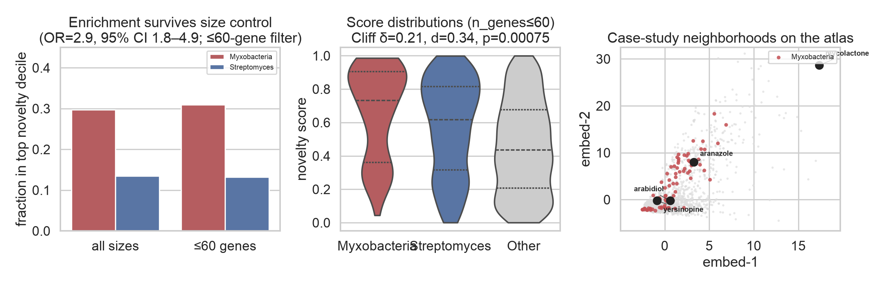

# bgc_atlas

**Finding.** Myxobacterial genomes occupy unusual biosynthetic architectures — more architecture-novel than *Streptomyces*, and the enrichment survives a ≤60-gene size control (**OR = 2.9**, 95% CI 1.8–4.9).

**Evidence.** Top-decile enrichment after the size filter; Cliff’s δ = 0.21; Cohen’s *d* = 0.34; *p* = 7.5×10⁻⁴. Leakage audits pass.

**Why this matters.** Unexplored biosynthetic space is not uniformly distributed across microbial lineages; some clades appear to systematically explore distinct architectural strategies.

**Question.** Can architecture novelty identify future discoveries?
**Answer.** Not yet — under a prospective MIBiG time split, architecture novelty underperforms a matched random control (held-out 0.40 vs control 0.50). Architectural novelty and discoverability are not the same thing.

[](https://github.com/snowe36/bgc_atlas/actions/workflows/ci.yml)
[](LICENSE)


Repo: [github.com/snowe36/bgc_atlas](https://github.com/snowe36/bgc_atlas)

---

## The biological result

```text
✓  Myxobacteria > Streptomyces in architecture novelty
      └── persists after ≤60-gene restriction
         OR=2.9 (95% CI 1.8–4.9) · δ=0.21 · d=0.34
✓  Architecture recovers known biosynthetic classes (RF macro-F1 0.76)
✓  Prospective: novelty does not predict MIBiG deposition
✓  Hashed architecture vs ESM novelty barely agree (ρ=−0.38, top-decile Jaccard 1.7%)
✓  Learned SupCon removes size correlation — still does not predict discovery
```

Without the ≤60-gene control, the story collapses to “myxobacteria have weird giant BGCs.” With it: myxobacteria appear to explore different architectural design space. Full stats: [`reports/biological_case_studies.json`](reports/biological_case_studies.json).



**Observed vs interpretation.** Novelty is measured *relative to an architecture representation*, not evolutionary innovation directly. The geometric pattern is consistent with lineage-specific biosynthetic design — a *biosynthetic grammar* in the conceptual sense.

Four MIBiG neighborhoods illustrate what the ranking surfaces:

| BGC | Host / product | What it demonstrates |
|-----|----------------|----------------------|
| [BGC0000103](https://mibig.secondarymetabolites.org/repository/BGC0000103) | *M. ulcerans* · mycolactone | **Small cluster, unusual architecture.** Rank-2 with only 9 genes. |
| [BGC0002490](https://mibig.secondarymetabolites.org/repository/BGC0002490) | *Y. pestis* · yersinopine | **Rare domain vocabulary.** DUF6 in only three MIBiG entries. |
| [BGC0001313](https://mibig.secondarymetabolites.org/repository/BGC0001313) | *A. thaliana* · arabidiol–baruol | **Cross-kingdom vocabulary.** Almost no bacterial analogue. |
| [BGC0001884](https://mibig.secondarymetabolites.org/repository/BGC0001884) | *Fischerella* · aranazoles | **Representation disagreement.** Architecture ≈ 0.99; ESM ≈ 0.59. |

---

## Atlas discovery candidates

Predicted BGCs scored against the MIBiG manifold (`bgc-apply` → [`reports/predicted_novelty_ranking.csv`](reports/predicted_novelty_ranking.csv)). Demo set for illustration — swap in antiSMASH outputs for real genomes ([`docs/pipeline.md`](docs/pipeline.md)).

| Genome | Cluster | Class | Score | Why interesting |
|--------|---------|-------|------:|-----------------|
| Rare actinobacterium | PRED0006 | other | 0.64 | Halogenase + P450 + redox cocktail outside major families; nearest MIBiG is *other* |
| Rare actinobacterium | PRED0007 | NRPS | 0.64 | Large NRPS with halogenase / glycosyltransferase tailoring; nearest neighbor is hybrid |
| *Myxococcus* sp. | PRED0008 | hybrid | 0.64 | Same clade signal as the atlas finding — PKS–NRPS hybrid with methyltransferase / halogenase / P450 |
| *Streptomyces* sp. | PRED0002 | PKS | 0.55 | Familiar taxon, mid-novelty glycosylated PKS — baseline contrast to the rare / myxo hits |
| *Bacillus* sp. | PRED0004 | RiPP | 0.49 | Compact lanthipeptide neighborhood; denser, more self-similar RiPP space |

---

## There is no universal novelty

Hashed architecture and ESM2 embeddings recover classes well (combined macro-F1 **0.84**) but barely agree on which BGCs look novel:

| Comparison | Spearman ρ | Top-decile Jaccard |
|------------|-----------:|-------------------:|
| Hashed vs ESM2 novelty | **−0.38** | **1.7%** |
| Hashed vs combined | −0.12 | 10.7% |
| ESM2 vs combined | — | 67.6% |

Different representations define different notions of novelty — sequence, architecture, evolutionary history, chemistry, and experimental tractability are distinct axes. Disagreement is itself a signal (aranazoles: familiar enzymes, unfamiliar assembly). Details: [`docs/esm.md`](docs/esm.md).


---

## Prospective validation (negative result)

Architecture novelty alone does **not** predict which BGCs enter [MIBiG](https://mibig.secondarymetabolites.org/) next. Fit the manifold on pre-cutoff entries; score post-cutoff vs a size-matched random control:

| Cutoff | Held-out mean | Control mean | p (held-out > control) |
|--------|--------------:|-------------:|-----------------------:|
| 2022-09-16 | **0.397** | **0.495** | **0.997** |

That is deliberate science, not a failed experiment. Discovery tracks sampling, taxa, chemotype accessibility, and funding — not only distance from known neighborhoods.


A leakage-safe SupCon encoder organizes classes (macro-F1 0.89†), removes novelty↔size correlation (~0.00 vs 0.53 for hashed), and still ties the control on the temporal test (p = 0.45). Progress on representation hygiene — not a claim that contrastive novelty predicts deposition. Sweep: [`reports/encoder_sweep_results.json`](reports/encoder_sweep_results.json).

†SupCon uses class labels in the contrastive loss — an upper-bound sanity check, not unsupervised discovery of class structure.

---

## What the repo builds

A reproducible instrument for the questions above:

1. **Featurize** MIBiG BGCs into architecture vectors (domain counts + hashed ordered architecture)
2. **Benchmark** class recovery (sanity: the space is biologically meaningful)
3. **Map** PCA atlas and **rank** leave-one-out kNN novelty
4. **Validate** leakage, size confounds, prospective temporal holdout
5. **Ablate** optional ESM2 embeddings and a contrastive set-encoder (GPU)


### Quick start

Requires [uv](https://docs.astral.sh/uv/):

```bash
git clone https://github.com/snowe36/bgc_atlas.git && cd bgc_atlas
uv sync --extra dev
bash scripts/reproduce.sh && uv run pytest -q
```

Full CLI, apply flags, and layout: [`docs/pipeline.md`](docs/pipeline.md).  
GPU path (ESM2 + encoder): [`docs/esm.md`](docs/esm.md).

### Class recovery & atlas (summary)

**2,762 × 342** feature matrix. Labels color the map — never enter novelty features.

| Model | Macro-F1 | Weighted-F1 |
|-------|---------:|------------:|
| Logistic regression | 0.65 | 0.68 |
| **Random forest** | **0.76** | **0.79** |

Hero ranking: [`reports/novelty_ranking.csv`](reports/novelty_ranking.csv). Validation audit: [`reports/validation_audit.json`](reports/validation_audit.json) (no class-label leakage; novelty↔gene-count Spearman 0.55 — hence the size control).


---

## Data

| Item | Detail |
|------|--------|
| Source | [MIBiG 4.0](https://mibig.secondarymetabolites.org/) JSON + GenBank |
| Featurized | **2,762** BGCs with gene annotations |
| Classes | PKS 717 · NRPS 556 · other 482 · hybrid 413 · RiPP 413 · terpene 181 |
| Temporal metadata | **100%** coverage via MIBiG changelog dates |
| Demo apply set | [`data/external/`](data/external/) (illustration only) |

---

## Limitations

- Scores reflect **architecture** or **embedding** divergence, not proven new chemistry
- Myxobacteria enrichment is relative to this representation; “biosynthetic grammar” is an interpretation
- Architecture novelty correlates with cluster size (Spearman **0.55**); ≤60-gene control and learned encoder address this
- Neither architecture nor contrastive novelty yet forecasts MIBiG deposition
- Novelty rankings are **representation-dependent**
- Demo apply candidates are illustrative; not a full antiSMASH-DB discovery campaign

---

## Future directions

- **Why myxobacteria?** Which domain combinations drive the enrichment
- **Representation disagreement as a filter** — ESM-familiar but architecture-novel (aranazole pattern)
- **Why novelty ≠ deposition** — taxon bias, accessibility, sampling economics
- Self-supervised objectives without class labels that keep size confound low
- Longer lead-time cutoffs and organism-stratified holdouts

---

## AI Assistance

Development of this repository was assisted by Cursor (AI-powered code editor) for code generation, refactoring, documentation, and routine implementation tasks. All scientific design, algorithmic decisions, validation, testing, and final code review were performed by the author.

---

## License

MIT
